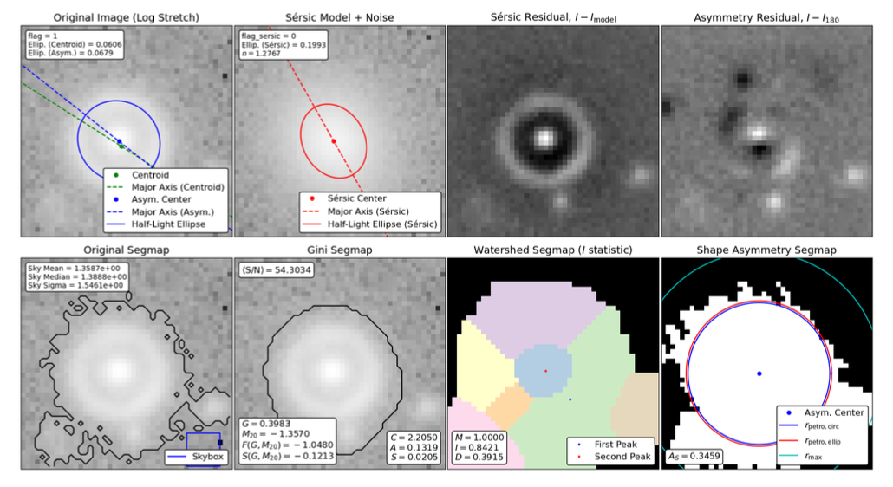
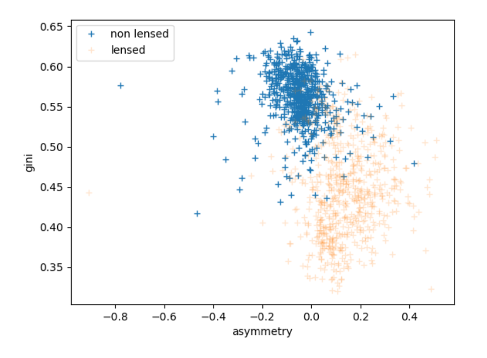
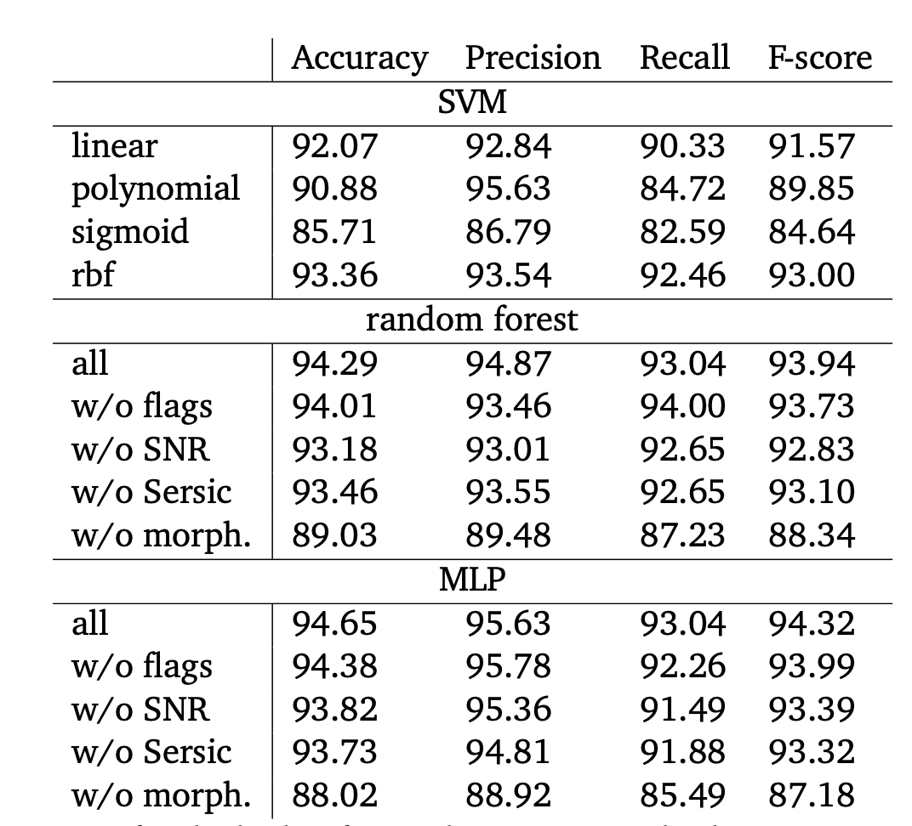

# Master Thesis : Innovative techniques to find strongly lensed systems

## LAISNEY Clément - June 2023

This repository is dedicated to my **master thesis** I presented in 2023 at the **University of Liege** for my **Master in Space Sciences**. It contains the code I used to perform my research. This repository does not contain the dataset I used because of copyright.

# Files

- [Master Thesis](doc/Master_Thesis.pdf)
- [Data exploration code](data_inspection.ipynb)
- [Main code](main.ipynb)

## What's a gravitational lens ?

A gravitational lens, also known as a cosmic mirage, is a distribution of mass (mostly galaxies) able to bend the light coming from a distant source (farther galaxies). This phenomenon is similar to a light beam bent through a lens by refraction. This is why we call it gravitational lensing.

## Description of this work

This work aims to explore innovative techniques to automate the detection of gravitational lenses. This time, Convolutional Neural Networks will be discarded, but parametric and non-parametric models will be explored and combined with the power of other machine-learning methods.

## Results

- Among numerous morphological indexes, asymmetry, concentration, and gini ones are the most relevant to detect gravitational lenses.

	- Asymmetry index : Asymmetry quantifies how rotationally symmetric the luminosity profile of the galaxy is. $A=\frac{\sum_{i,j}|I(i,j)-I_{180}(i,j)|}{\sum_{i,j}|I(i,j)|}-B_{180}$
	- Concentration index : Concentration, is the logarithmic ratio between the 80% total flux radius and the 20% total flux radius. $C=5\log(\frac{r_{80}}{r_{20}})$
	- Gini index : the Gini coefficient measures the inequality of light in the light distribution within the galaxy. $G=\frac{1}{2\bar{X}n(n-1)}\sum^n_{i=1}\sum^n_{j=1}|X_i-X_j|$

- The Multi-Layer Perceptron is the best classifier algorithm in terms of precision and recall.
